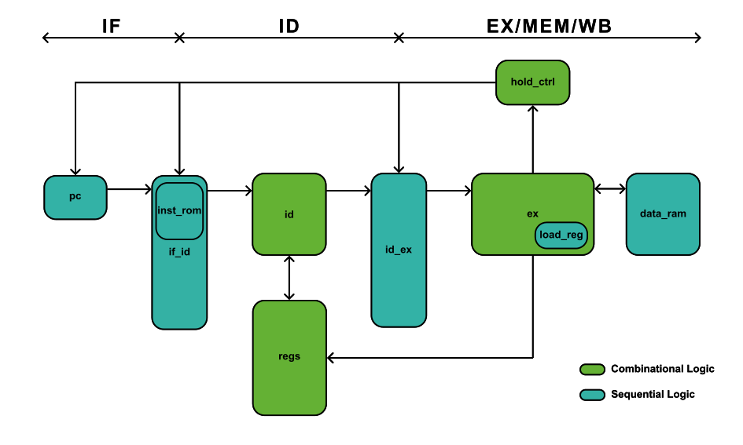

# my-riscv

**Experimental Project.** This repository documents my personal exploration into RISC-V processor design. Not intended for formal educational use, but you can use this as a reference of how a beginner like me tried to learn riscv cpu.

## References, Credits and Inspirations

This project draws heavily from the following resources:

- `tinyriscv`: https://github.com/liangkangnan/tinyriscv
    - `my-riscv`'s core design logic is based on the 3-stage pipeline structure of `tinyriscv`. that is targeted on simplicity, focusing solely on the CPU core. The instruction ROM and data RAM fetch processes have been simplified, and peripherals such as UART, SPI, and JTAG are excluded.
    - removed interconnect bus and the total pipeline stall comes with fetching from rom and ram over interconnect bus. Instead, rom and ram is tightly coupled with the pipeline.

- `OPENMIPS`: from the book _write a CPU yourself_ https://github.com/yufeiran/OpenMIPS
    - Referenced how other cpu's are made in verilog, act as a complement to `tinyriscv`

- `NJUCS 2023 Digital Logic and Computer Organization` Course Project: https://nju-projectn.github.io/dlco-lecture-note/exp/11.html
    - Provided decent amount of information about building a single-cycle rv32i cpu

## Overview

A simple three-stage pipelined RISC-V CPU implementing the RV32I instruction set architecture (ISA).


`defines.v`: Defines Macros like buses, opcodes, funct3/7, the 16‑bit control encoding, etc.

`pc.v`: PC pointer. Have three behaviors: jump, hold, or +4.
- Sequential logic

`inst_rom.v`: Instruction rom. Able to do syncronous read and write; memories with addr[31:2] drop (enforces word alignment).
- Sequential logic

`data_ram.v`: Data ram. Able to do syncronous read and write; memories with addr[31:2] drop (enforces word alignment).
- Sequential logic

`regs.v`: 32×32 regfile, synchronous write, combinational reads with simple WB‑bypass.
- Combinational logic

`id.v`: Decoder builds immediates (I/S/B/U/J), selects ALU ops, sets branch class, memory width/sign, and MemToReg.
- Combinational logic

`if_id.v`: Pipeline latch between **if** and **id**. Flush and hold behavior is controlled by `hold_ctrl.v`. Instruction Rom is integrated inside of `if_id.v` instead of placing along with `pc.v` before `if_id.v` it to prevent an extra clock cycle in **id** stage.
- Sequential logic

`id_ex.v`: Pipeline latch between **id** and **ex**. Flush and hold behavior is controlled by `hold_ctrl.v`. 
- Sequential logic

`ex.v`: handles the ALU; branch target/decision; data‑width packing/unpacking for loads/stores; extra load/WB two‑beat register; hazard control
- Mainly combinational logic, but with a sequential logic load register that stores the load instruction (destination register address/write enable/write width/write source) during load operation

`hold_ctrl.v`: translates EX’s {load_busy, branch_en} into the specific hold/flush flags for each stage.
- Combinational logic

## RISC-V Toolchain Setup

To transfer your risc-v assembly into hex code that can be stored directly in inst_rom, you need to install the risc-v toolchain. After trying both, I personally mainly use windows, since most of my design files are in my windows machine. You can choose Ubuntu if you like.

### Windows setup
Follow the instruction in The xPack GNU RISC-V Embedded GCC: https://github.com/xpack-dev-tools/riscv-none-elf-gcc-xpack, I personally used the global install mentioned in project website's Installation instruction page.

### Ubuntu setup
You can choose to build the toolchain yourself following the official instruction https://github.com/riscv-collab/riscv-gnu-toolchain, or to use a prebuit toolchain. 

For simplicity, I personally used the prebuit toolchain from https://github.com/stnolting/riscv-gcc-prebuilt

to setup the `Prebuilt RISC-V GCC Toolchains for Linux`:

First, download the package:

```
wget https://github.com/stnolting/riscv-gcc-prebuilt/releases/download/rv32i-131023/riscv32-unknown-elf.gcc-13.2.0.tar.gz
```

Then extract:

```
sudo mkdir -p /opt/riscv
sudo tar -xzf riscv32-unknown-elf.gcc-13.2.0.tar.gz -C /opt/riscv/
```

Then add the toolchain `bin` to your PATH:

```
export PATH="$PATH:/opt/riscv/bin"
```

Or to make it permanent, you can go:
```
nano ~/.bashrc
```

Then scroll to bottom to this shell's startup files, and add a new line there:
```
# Add RISC-V toolchain to PATH
export PATH=$PATH:/opt/riscv/bin
```
## Compile (temp)
To Compile a rv32i assembly, paste your code inside `/compile/inst_rom.s`

Then run 

```
make
```

And copy the hex code to `/hdl/inst_rom.mem`

## Automated Tests

## Data Hazard Handleing

- **Branch**: handled in EX stage
    - When there is successful branch detected, `ex.v` will send a pipeline flush signal to `hold_ctrl.v`.
    - `pc.v` will jump to the designated address, while `if_id.v` and `id_ex.v` will output `NOP` to the next stage. Which is equavalent to take a Branch while flushing the two falsely fetched instructions after Branch.
- **Load**: handled in EX stage
    - When there is a load detected, `ex.v` will send a pipeline hold signal to `hold_ctrl.v`.
    - `pc.v` and `if_id.v` will hold on to its current output value, while `id_ex.v` will output `NOP`. Which is equavalent to waiting for the data loaded from the data ram to be written to the register files.
- **Read after Write**: handled in register file
    - Upon read after write, bypass the write value directly to the read.

## To Do
- Finish documentation
- More test automation
- Revise comments


